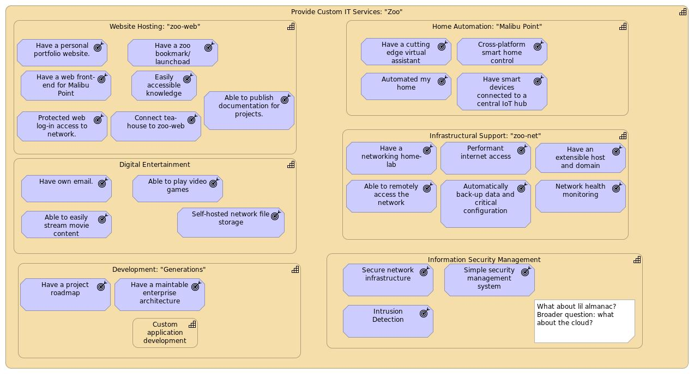

# Zoo-ArchiMate
An ArchiMate model for Zoo, a conceptual custom IT service provider.

This model is used to:
1) Maintain an architecture of my personal IT initiatives for documentation purposes.
2) Practice ArchiMate modeling to develop and maintain my modeling skills.
3) Educate and spread awareness on the importance of enterprise architecture and how to use the ArchiMate framework.



## Getting Started
For those able to use the source option it is best,

For beginners it is recommended to try out the HTML documentation site.
If you do not wish to download the code, the PDF jasper report can be rendered in your browser.

## Using the Diagram

### Source
Using the source of the diagram.
The diagram is developed in .archi format.
An xml file is also included in ```/exports/``` if you would like to 

### HTML Documentation Site
The diagram is exported as an interactive HTML documentation website.
this can be found in

### Jasper Reports

## Contributing
Currently [FrostTusk](github.com/FrostTusk) is the sole contributor for the project.

### Submitting Changes
Suggested changes can be submitted by creating a pull request.
Make sure to export to all file formats before submitting exports/html/ exports/zoo-archimate.csv exports/zoo-archimate.xml and exports/reports)
Before submitting any change
Make sure to read the [namespaces section](#Namespaces) when adding new views or folders.

### Namespaces
This archimate project is structured using namespaces.
Namespaces help keep view filenames descriptive and ensures views are ordered correctly in reports.
They work by prepending [\<namespace id\>] (with namespace code being a unique 2 letter (or 1 if it's the first namespace) code that describes the namespace).
Example: [ABCD] defined by [AB] Artilley Basics and [ABCD] Artilley Basics Collateral Damage.
An important file is denoted by adding an exclamation mark "!" at the end of the namespace id.
This ensure that important view is rendered before any other views within the namespace.
For example: [AB!] denotes an important view in the Artilley Basics namespace.


There are two exceptions to this rule: library views are prepended with "__" and deprecated views are prepended with "_".

## Guide to Views
The following views are maintained:
1. **Actors**: This view outlines the main actors involved in the overall architecture.
2. **Motivation**: The underlying motivation of
3. **Technology**:
4. **decompositions/**: 
5. **capabilities/**:
6. **deprecated**: Outdated architectural views and drafts.
